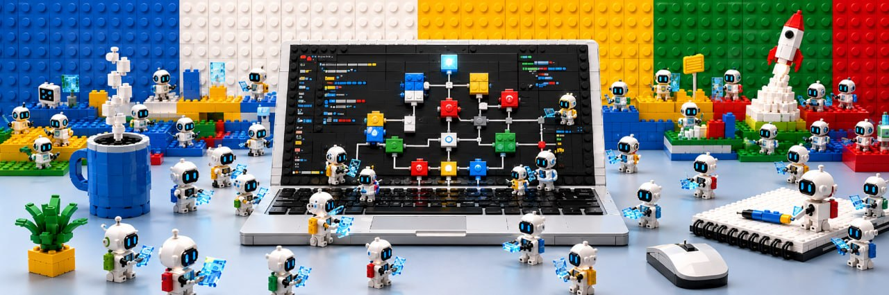
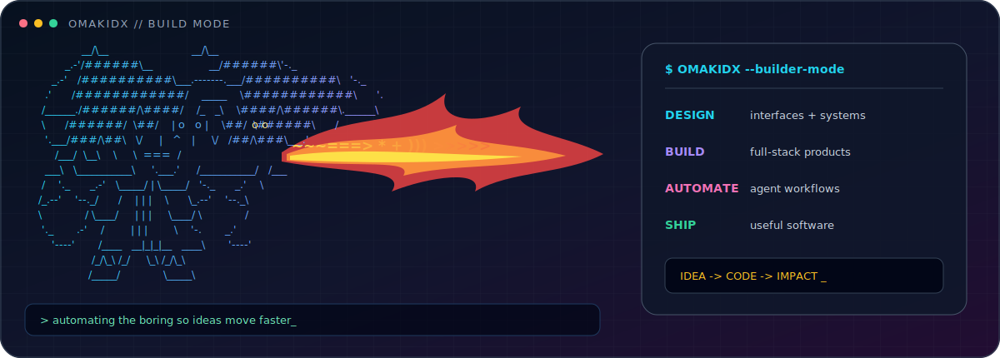
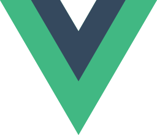
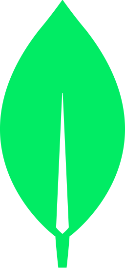
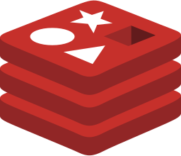
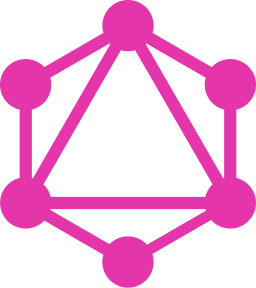
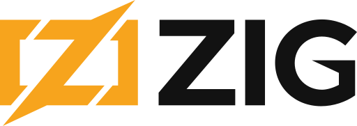

<!--
  GitHub profile README for @Omakidx.
  The header image is the user-supplied banner and belongs at:
  assets/header-banner.png
-->

  

<h1 align="center">Omoiya Muhammed Awwal</h1>

  <strong>Full-stack engineer · product-minded designer · automation enthusiast</strong>

  I design clear product experiences, engineer dependable systems, and turn repetitive work into software.
   
  From the first Figma frame to the final deployment, I like owning the whole journey.

  <a href="#selected-work">Selected work</a>
  &nbsp;·&nbsp;
  <a href="#toolkit">Toolkit</a>
  &nbsp;·&nbsp;
  <a href="https://github.com/Omakidx?tab=repositories">All repositories</a>

---

## About me

I'm **[@Omakidx](https://github.com/Omakidx)** — a builder working where product design, full-stack engineering, and automation meet.

- I turn product ideas into polished, responsive interfaces and production-ready services.
- I enjoy authentication, real-time systems, developer tooling, and agentic workflows.
- I move comfortably between design decisions, frontend details, APIs, data, and deployment.
- I believe the boring, repeatable parts of work should be automated whenever possible.

  

## Selected work

<table>
  <tr>
    <td width="50%" valign="top">
      <h3><a href="https://github.com/Omakidx/saveswitch">01 / Saveswitch</a></h3>
      
Copy, save, share, and organize text, links, and images across devices—with quick anonymous sharing and persistent personal spaces.

      
<code>Next.js</code> <code>React</code> <code>Bun</code> <code>Elysia</code> <code>Drizzle</code> <code>Neon</code>

    </td>
    <td width="50%" valign="top">
      <h3><a href="https://github.com/Omakidx/maxxy-me">02 / Maxxy-Agent</a></h3>
      
Portable coding-agent roles, workflows, and engineering gates that travel across Codex, Claude, Copilot, Cursor, Windsurf, and OpenCode.

      
<code>Agent workflows</code> <code>Shell</code> <code>Developer tools</code>

    </td>
  </tr>
  <tr>
    <td width="50%" valign="top">
      <h3><a href="https://github.com/Omakidx/WURK-x-METAPLEX">03 / WURK × Metaplex</a></h3>
      
TypeScript tooling for Metaplex-registered Solana agents to create paid Wurk jobs through x402 and SIWX flows.

      
<code>TypeScript</code> <code>Solana</code> <code>Metaplex</code> <code>x402</code>

    </td>
    <td width="50%" valign="top">
      <h3><a href="https://github.com/Omakidx/node_auth">04 / Node Auth</a></h3>
      
A complete authentication and authorization system with Google OAuth, TOTP 2FA, email verification, refresh tokens, and RBAC.

      
<code>TypeScript</code> <code>Next.js</code> <code>Express</code> <code>MongoDB</code>

    </td>
  </tr>
  <tr>
    <td width="50%" valign="top">
      <h3><a href="https://github.com/Omakidx/link6ync">05 / Link6ync</a></h3>
      
A full-stack URL shortener with QR-code generation and scanning, built as a focused end-to-end product.

      
<code>Next.js</code> <code>React</code> <code>Express</code> <code>MongoDB</code>

    </td>
    <td width="50%" valign="top">
      <h3><a href="https://github.com/Omakidx/phone-number-input0component">06 / Phone Input Components</a></h3>
      
A collection of polished international phone-input variants powered by libphonenumber-js and reusable React patterns.

      
<code>React</code> <code>Next.js</code> <code>TypeScript</code> <code>UI engineering</code>

    </td>
  </tr>
</table>

  <a href="https://github.com/Omakidx?tab=repositories"><strong>Explore every repository →</strong></a>

## Toolkit

These are the tools I reach for most often—from product thinking and interface work to backend systems and automation.

<table>
  <tr>
    <td width="20%" align="center"> <strong>Figma</strong></td>
    <td width="20%" align="center"> <strong>TypeScript</strong></td>
    <td width="20%" align="center"> <strong>Go</strong></td>
    <td width="20%" align="center"> <strong>Next.js</strong></td>
    <td width="20%" align="center"> <strong>React</strong></td>
  </tr>
  <tr>
    <td width="20%" align="center"> <strong>Vue</strong></td>
    <td width="20%" align="center"> <strong>Bun</strong></td>
    <td width="20%" align="center"> <strong>Node.js</strong></td>
    <td width="20%" align="center"> <strong>Drizzle</strong></td>
    <td width="20%" align="center"> <strong>Python</strong></td>
  </tr>
</table>

  &nbsp;&nbsp;
  &nbsp;&nbsp;
  &nbsp;&nbsp;
  &nbsp;&nbsp;
  &nbsp;&nbsp;
  &nbsp;&nbsp;
  &nbsp;&nbsp;
  &nbsp;&nbsp;
  &nbsp;&nbsp;
  &nbsp;&nbsp;
  &nbsp;&nbsp;
  &nbsp;&nbsp;
  &nbsp;&nbsp;
  &nbsp;&nbsp;
  &nbsp;&nbsp;
  

  JavaScript · Tailwind CSS · Express · Django · FastAPI · PostgreSQL · MongoDB · Redis · GraphQL · Supabase · Docker · Git · GitHub · Vercel · Solidity · Zig

## Let's build something useful

I am most interested in products where thoughtful design, solid systems, and automation reinforce one another. Browse the work above, explore the rest of my repositories, or follow along with what I ship next.

  <a href="https://github.com/Omakidx?tab=repositories"><strong>Browse projects</strong></a>
  &nbsp;·&nbsp;
  <a href="https://github.com/Omakidx"><strong>Follow @Omakidx</strong></a>

---

  Technology marks belong to their respective owners. SVGs curated from <a href="https://github.com/ln-dev7/logos-apps">Logos Apps</a>.

